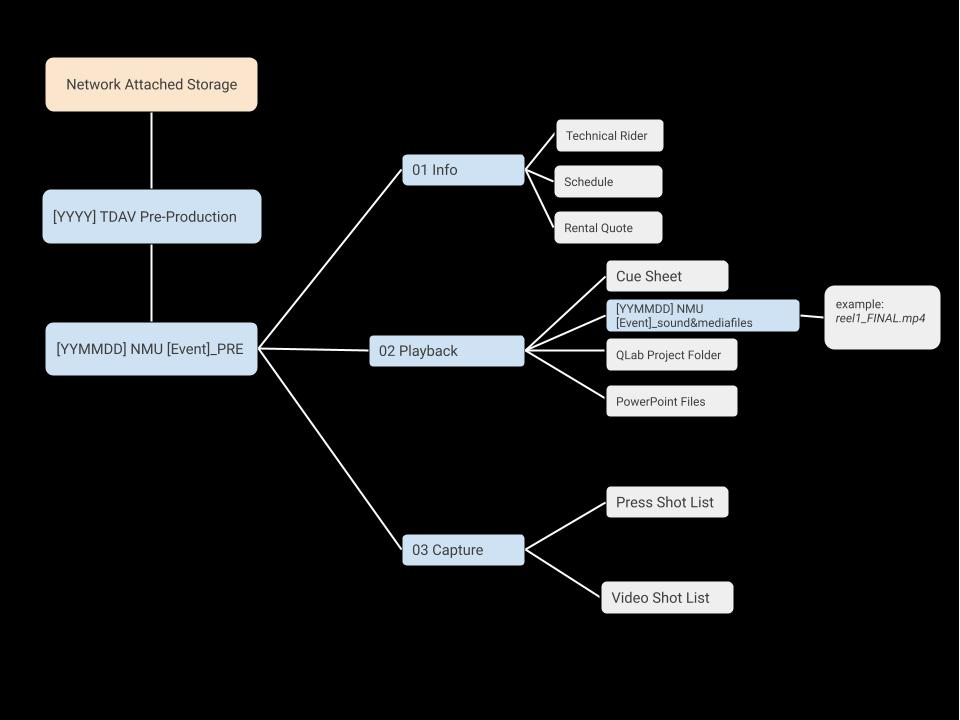
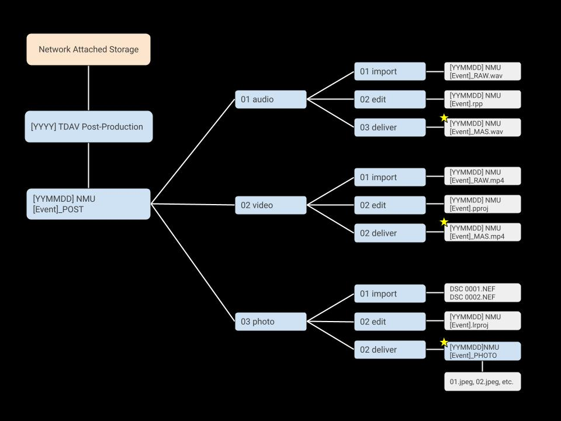

[return to index](../index.md)
# Standards of Practice
## Communication
Effective communication is essential for the proper and safe execution of duties. All communication between students and staff must be prompt and professional. Accommodations will be made if students wish to keep their contact information private from the team, but it is ideal if the Sound & Media Supervisor and the Crew Lead have everyone’s contact information.

As crew sizes increase and roles become more specialized, communication between team members should be more localized and independent. This approach allows everyone to focus on their tasks with minimal confusion caused by conflicting opinions or misunderstood directions. i.e. a Stage Hand setting up microphones will refer to the Audio Technician’s instructions prior to asking the Audio Engineer, and will certainly not refer to the Press Manager for directions since their tasks and priorities lie with the Post Production Team. [The TDAV Crew diagram](../assets/tdav_crew.jpg) is a good way to visualize this flow of communication.

- **Verbal** – Self-explanatory
- **Phone Call/Text Message** – Ideal for checking on team members if they are late or need immediate updates on production information.
- **Clear Com** – During a production, team members will use a wireless intercom on the RF channel according to their roles.
- **Group Instant Message** [Whats.app](https://www.whatsapp.com/) – For students to ask questions to the entire team, and for admin to correspond with their respective subteams. Ie. the Press manager will discuss with just the press team. This works on btoh mobile phones and computers.
- **University Email** – For sending schedules, performance reports, course materials, and production information. Emails will generally be sent in the mornings; responses are not expected to be as immediate as with the above instant messaging formats.
  -  **Priorities List-Serv:** There will be a group email sent out regularly, with list of priorities according to crew/individual duties.
# Ladder Saftey Training
All students are required to complete the following online courses from the American Ladder Institute's [Saftey Training](https://www.laddersafetytraining.org) and send a certificate of completion to the course instructor by the assigned due date:
1. Step Ladder Safety Training
2. Single Ladders & Extension Ladders
3. Articulated Ladders
4. Mobile Ladder Stands & Mobile Ladder Stand Platforms

*Additionally, all TDAV crew should take Fall Protection Class and Mobile Lift Training provided by the university.*
## Scheduled Breaks
Work breaks are essential to keep the crew healthy and productive during long hours. Regular breaks help prevent fatigue and reduce stress. It's recommended to schedule short breaks every two hours and a longer meal break. Providing rest areas and ensuring everyone takes their breaks can improve energy levels and keep the team working well together. Below are the Union Rules for workbreaks followed by my suggestion for workbreaks within theatre academia.

**Union Rules:**
- 2 Hours Work = 10-minute break
- 5 Hours Work = 30-Minute Break

**Suggestion:**
- 2 Hours Work = 20-minute Break
- 5 Hours Work = 1-hour break

**Double Commuting**
Please take into consideration each crew member's commute time when scheduling their hours. If a crew member must commute 30 minutes or more, it is ideal that they either go home after a shift, or stay for the whole day.
## Crew Software
By specifying which software’s the crew uses, it will be easier to teach, communicate, and avoid any format discrepancies. It will also be easier troubleshoot any issues if we are all using the same programs. The administrators will remind crew members to keep their software up to date and should forward any notifications regarding software updates or additions. 

It is also ideal if incoming clients are aware of what software and versions we use, so they may prepare their materials accordingly. Administrators should definetly give clients the heads up on this prior to a tech or rehearsal.

For the most part, except for QLab, we are using softwares that are availble across the various operating systems including MacOs, Linux, Windows, and Ubuntu. I also aim to choose free and/or open source softwares as much as possible.
[Go to Assigned Software](assigned_software.md)
## Naming Folders and Files
- **Master Folder**: 
  - Format: `[YYMMDD] NMU [Event]`
  - Example: `240803 NMU Grease`
- **Subfolder**:
  - Format: `[00] [Area]`
  - Examples: `01 Audio`, `02 Media`, `03 Video`, etc.
- **RAW Recording Files:** 
  - Format:`[YYMMDD] NMU [Event]_RAW.[ext]`
  - Example: `240803 NMU Grease_RAW.mp4`
- **Edited Recording Files:** 
  - Format: `[YYMMDD] NMU [Event]_MAS.[ext]` 
  - Example: `240803 NMU Grease_MAS.mp4`
## Recording Formats
- **Audio**
   - Format: WAV
   - Sample Rate: 48 kHz
  - Bit Depth: 24-bit
- **Video**
  - Format: MP4, MOV
  - Resolution: 1920 x 1080
  - Frame Rate: 30 or 60 FPS
- **Photo**
  - *Capture:*
    - Format: RAW ie. NEF (Nikon), CR2 (Canon), BRAW (Black Magic Design)
    - Color Space: Standard RGB
  - *Deliverables:*
    - Format: JPEG (.jpeg)
    - Ratio: (35 mm) 3:2 or 2:3, reformat later if 16:9 is desired for a video display.
## Live Stream Settings
1. Resolution: 1920 x 1080 (1080p)
2. Frame Rate: 30 or 60 FPS
3. Video Bitrate: 4500 – 6000 kbps
4. Encoder: NVENC (GPU)
5. Audio Bitrate: 128 or 192 kbps
6. Audio Sample Rate: 48 kHz
## Labeling Equipment
Labeling AV equipment in a theatre is crucial for efficient operation and troubleshooting. Clear labels ensure that crew members can quickly identify and connect equipment, minimizing setup time and reducing the risk of errors. Accurate labeling also facilitates easier maintenance and repairs, as well as effective communication among team members. By using a consistent labeling system, the theatre can maintain an organized and functional AV environment, leading to smoother productions and fewer technical disruptions.
### General Hardware
1. Label Format:
    - Category: Indicates the type of equipment (e.g., `LIGHT`, `MIC`, `STAGE`).
    - Identifier: Unique number or name (e.g., `01`, `A`, `B1`).
    - Location/Use: Specifies the equipment’s typical location or primary use (e.g., `FOH` for Front of House, `GR` for Green Room).
1. Label Placement:
     - Equipment: Affix labels in a visible, consistent location on each item.
     - Racks/Cases: Label the outside of racks or cases clearly.
1. Labeling Materials:
    - Use durable, adhesive labels or tags designed for various surfaces.
    - Ensure labels are large enough to be easily readable and securely attached.
2. Documentation: Maintain an inventory list or diagram showing the labeled equipment and its purpose or location.
### Ethernet Cables
1. Label Format:
   - Prefix: Site/Building identifier (e.g., `B1`, `C3`)
   - Rack/Panel: Rack number or panel (e.g., `R1`, `P2`)
   - Port Number: Port or outlet number (e.g., `Port 12`)
   - Cable Identifier: Cable number or ID (e.g., `C03`)
2. Label Placement:
   - Cable Ends: Label both ends of the cable.
   - Patch Panels: Label each port on the patch panel.
   - Switches: Label switch ports according to the corresponding patch panel and port.
3. Labeling Materials:
   - Use durable, adhesive labels designed for network cables.
   - Ensure labels are clear and legible.
4. Documentation: Maintain a network diagram and cable inventory for reference.
### Audio Cables
1. Label Format:
   - Prefix: Indicates the type of connection or equipment (e.g., `MIX` for mixer, `AMP` for amplifier).
   - Cable Number: Unique identifier for each cable (e.g., `01`, `02`).
   - Source/Destination: Describes where the cable connects (e.g., `MIC1` for Microphone 1, `SPKR` for Speaker).
   - Port/Channel: Specifies the port or channel number (e.g., `CH1`, `OUT2`).
2. Label Placement:
   - Cable Ends: Label both ends of the cable.
   - Cable Sleeves: Use cable sleeves or tags for easy identification.
3. Labeling Materials:
   - Use durable, adhesive labels or cable tags designed for audio equipment.
   - Ensure labels are clear, legible, and securely attached.
4. Documentation:
   - Maintain a diagram or list of cable assignments and connections.

## Digital Storage Infrastructure
This is how we will store our files for pre- and post-production. This format ensures that files are easily accessible through a basic search query according to date, event, and file type. Additionally, this format follows the workflow allowing for users to graduate from one step to the next while reserving backups, naturally.
### Pre-Production Folder Structure

### Post-Production Folder Structure
